# v1

This is the first version of Anchor. There are some features decided to be the minimum viable product, including:  

- [Auth](https://github.com/oscariqbal/anchor-pfa_be/tree/main/docs/v1/authentication)  

- [Wallet](https://github.com/oscariqbal/anchor-pfa_be/tree/main/docs/v1/wallet)  
    Wallet define user's money location and act as an identity to a transaction records and plans that represent user's financial decision's money location.

- [Transaction](https://github.com/oscariqbal/anchor-pfa_be/tree/main/docs/v1/transaction)  
    Transaction record define user's financial decision that users want to record.

You can view the demo [here](https://www.figma.com/proto/FVz9sy3h64BXfEuuckffpL/Anchor?node-id=0-1&t=aPc9g8TjEtn0XeIq-1).

